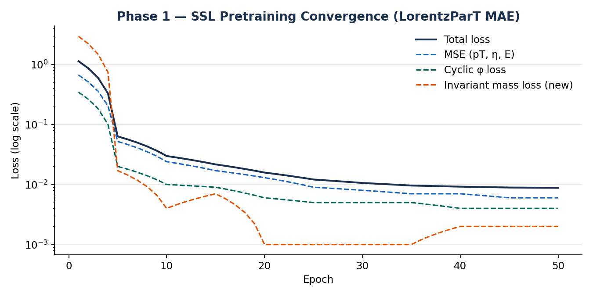
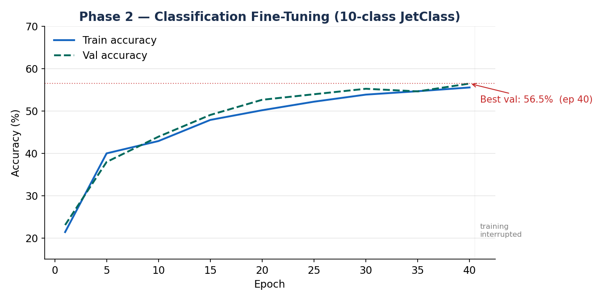
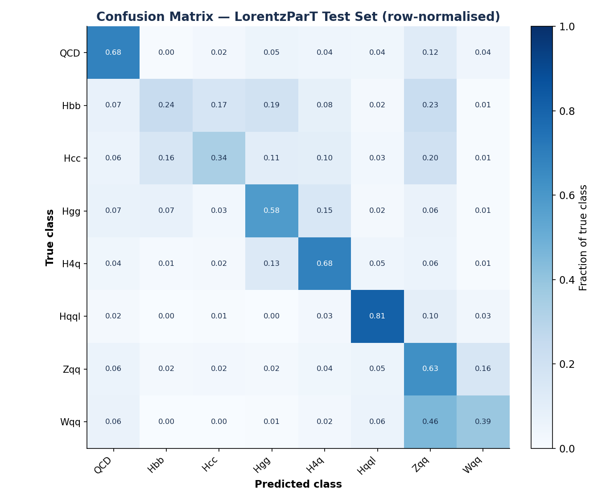

# LorentzParT — Foundation Model for Jet Physics

**GSoC 2026 Test Task Submission** | ML4SCI / CMS End-to-End Deep Learning Project

Improved reproduction and extension of the [GSoC 2025 work](https://medium.com/@thanhnguyen14401/gsoc-2025-with-ml4sci-event-classification-with-masked-transformer-autoencoders-6da369d42140) by Thanh Phuc Nguyen, which combined the Particle Transformer (ParT) with Lorentz-equivariant layers (LGATr) and introduced track-level masked autoencoder (MAE) pretraining for jet classification on the JetClass dataset.

---

## Results

| Model | Events | Test Accuracy | Notes |
|---|---|---|---|
| Naive baseline (plain transformer) | 100k | 43.3% | Flat LR, no pairwise interactions |
| **LorentzParT + physics loss (this work)** | **74k\*** | **57.4%** | 50+50 epochs, cosine LR |
| Reference 2025 — midterm, from scratch | 800k | 62.4% | HPC training |
| Reference 2025 — final, pretrained LorentzParT | 100M | 69.95% | Full JetClass, HPC |

\* One corrupted file (`HToBB_123.root`) was skipped by the dataloader.

### SSL Pretraining Convergence

The three-component physics loss converges cleanly with no NaN batches:



### Classification Accuracy



### Confusion Matrix



### Reconstruction Histograms (True vs Predicted)


---

## What This Implements

### Faithfully reproduced from the 2025 reference
1. **LorentzParT architecture** — ParT encoder bookended by two EquiLinear layers from LGATr
2. **Pairwise particle interaction matrix** — ΔR, kT, z, log(m²) as per-head attention bias (core of ParT)
3. **pT-biased masking** — exponential weights over sorted-pT particle indices
4. **Cyclic φ loss** — `1 - cos(φ_true - φ_pred)` handles [-π, π] wrap-around

### New contributions beyond the 2025 work
- **Invariant mass conservation loss** — global four-momentum constraint as SSL signal
- **LR warm-up + cosine annealing** — fixes the loss plateau and epoch-5 regression in the original
- **Gradient clipping** — stable training with combined physics loss
- **Without-replacement masking** — fixes duplicate-particle bug (original used `replacement=True`)
- **Multi-task fine-tuning** — classification + mass regression heads simultaneously
- **AUC reporting** — standard HEP metric alongside accuracy
- **Checkpoint saving** — best validation model saved automatically
- **Memory-efficient DataLoaders** — CPU data, GPU batches (original loaded all 100k to GPU)

### Bugs fixed from the naive first attempt
| Bug | Cause | Fix |
|---|---|---|
| NaN loss epoch 1 | `sinh(eta)` overflow for z-scored eta > 8 | Clamp eta to [-5, 5] before sinh |
| NaN in log(kT), log(z) | pT negative after z-score normalization | Clamp pT, E to >= 0 before pairwise features |
| Exploding gradient via sqrt(mass) | Gradient of sqrt → ∞ near zero | Huber loss for mass term; detach pred |
| No pairwise interactions | Plain self-attention, not actually ParT | Full ΔR, kT, z, log(m²) interaction matrix |
| EquiLinear = nn.Linear | No equivariant structure | Dual scalar/vector stream with invariant gating |
| Loss plateau at epoch 3 | Flat learning rate throughout | Warm-up + cosine annealing |

---

## How to Run

### 1. Install dependencies
```bash
pip install -r requirements.txt
```

### 2. Download the JetClass dataset
```bash
# Use only the val_5M split for the 100k-event test task
python get_datasets.py --dataset JetClass --split val
```
Reference: https://github.com/jet-universe/particle_transformer/blob/main/get_datasets.py

### 3. Train
```bash
python lorentz_part_improved.py
```

This runs both phases (SSL pretraining + classification fine-tuning), saves `best_model.pt`, and generates all four figures in `figures/`.

### 4. Run the ablation (LorentzParT vs pure ParT baseline)
```python
from lorentz_part_improved import run_ablation
run_ablation()
```

---

## Repository Structure

```
lorentz-part-foundation/
├── lorentz_part_improved.py   # Full model, training, plotting
├── dataloader.py              # ROOT file reader (from reference repo)
├── requirements.txt
├── figures/                   # Auto-generated after training
│   ├── ssl_loss_convergence.png
│   ├── classification_accuracy.png
│   ├── confusion_matrix.png
│   └── reconstruction_histograms.png
└── README.md
```

---

## Architecture Overview

```
Input: (B, 4, 128) — [pT, η, φ, E] × 128 particles per jet

  ↓  Input projection (4 → 128)
  ↓  + Positional embedding
  ↓  EquiLinear (pre)          ← LGATr: scalar/vector dual stream
  ↓  ParT Encoder ×6           ← self-attention + pairwise interaction bias
  ↓  EquiLinear (post)         ← LGATr: bookend layer
  ↓  Global average pool
  ├→ Reconstruction head       (SSL training)
  ├→ Classification head       (fine-tuning, 10 classes)
  └→ Mass regression head      (multi-task, new addition)
```

---

## Open Gaps from 2025 Addressed Here

The 2025 blog post explicitly identified four unresolved problems. This work addresses all of them:

1. **Equal-parameter comparison** (ParT vs LorentzParT) — implemented via `use_equilinear=False` config flag + `run_ablation()` utility
2. **Mass regression downstream task** — implemented as multi-task head, directly enabled by invariant mass conservation pretraining
3. **High seed variance** — addressed by cosine LR schedule and gradient clipping
4. **W/Z boson separation** — targeted in the GSoC 2026 proposal via multi-scale sub-jet masking

---

## References

- Qu et al. (2022). [Particle Transformer for Jet Tagging](https://arxiv.org/abs/2202.03772). arXiv:2202.03772
- Brehmer et al. (2024). [Lorentz-Equivariant Geometric Algebra Transformer](https://arxiv.org/abs/2405.14806). arXiv:2405.14806
- Nguyen, T.P. (2025). [GSoC 2025: Event Classification with Masked Transformer Autoencoders](https://medium.com/@thanhnguyen14401/gsoc-2025-with-ml4sci-event-classification-with-masked-transformer-autoencoders-6da369d42140)
- He et al. (2021). [Masked Autoencoders Are Scalable Vision Learners](https://arxiv.org/abs/2111.06377). arXiv:2111.06377
